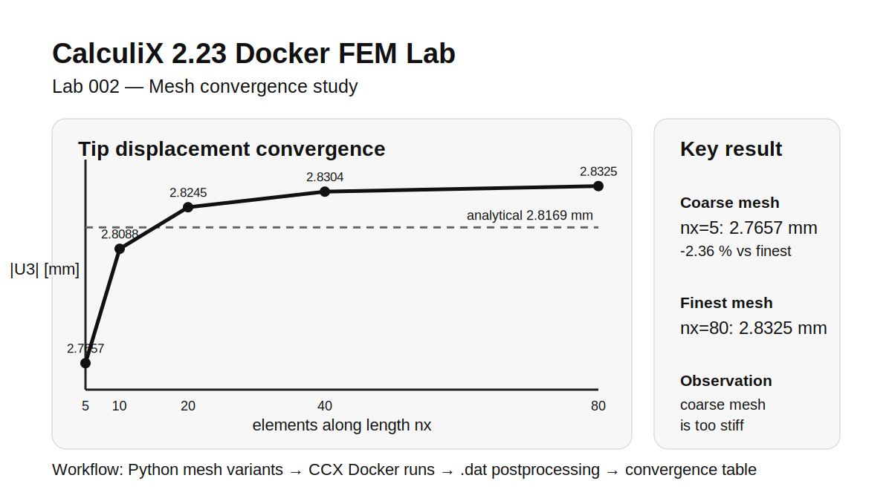

# Lab 002 — Mesh Convergence Study

This lab extends Lab 001 with a simple mesh convergence study for the cantilever shell benchmark.

## Result summary

The computed tip displacement increases with mesh refinement and converges toward the finest FE reference solution.

| nx | elements | mean abs(U3) [mm] | error vs finest [%] |
|---:|---------:|------------------:|--------------------:|
| 5  | 25  | 2.765670 | -2.359 |
| 10 | 50  | 2.808822 | -0.836 |
| 20 | 100 | 2.824509 | -0.282 |
| 40 | 200 | 2.830381 | -0.074 |
| 80 | 400 | 2.832489 | 0.000 |

The goal is to investigate how the computed tip displacement changes with increasing mesh refinement.

## Planned workflow

1. Generate several CalculiX input files with different mesh densities
2. Run all cases with CalculiX 2.23 inside Docker
3. Extract the vertical tip displacement from each .dat file
4. Compare all results with the analytical Euler-Bernoulli reference value
5. Write a compact CSV and Markdown summary
6. Create a small convergence result card
