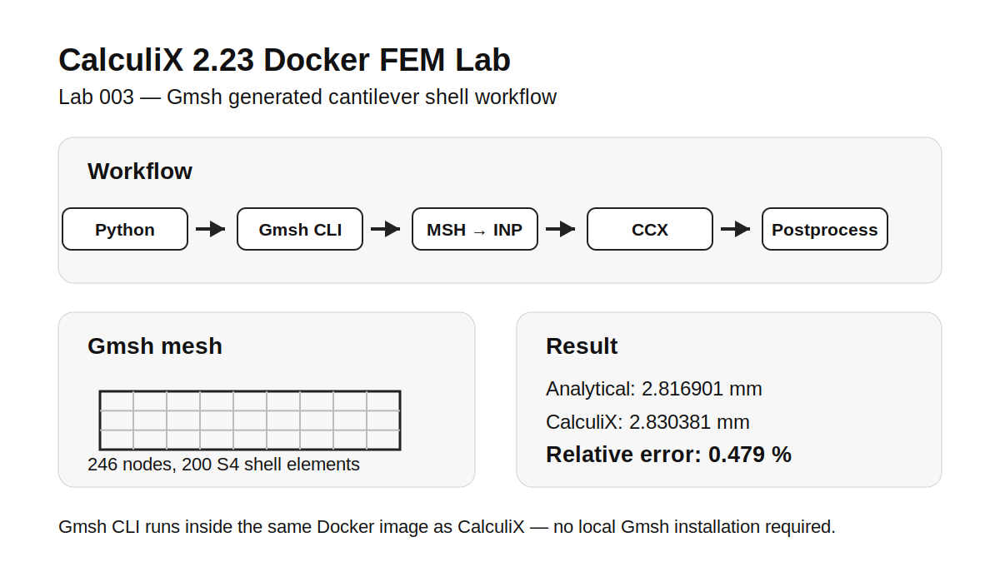

# Lab 003 — Gmsh Cantilever Shell Workflow

This lab extends the previous cantilever shell examples by adding Gmsh-based mesh generation.

## Result summary

The Gmsh-generated shell mesh reproduces the same result as the direct Python-generated mesh from Lab 001 and the nx=40 case from Lab 002.

    Analytical tip displacement:       2.816901 mm
    CalculiX mean abs(U3) load nodes:  2.830381 mm
    Relative error based on abs(U3):   0.479 %

## Mesh and workflow

    Nodes: 246
    S4 shell elements: 200

The complete workflow is:

    Python .geo generation
    Gmsh CLI meshing inside Docker
    MSH-to-CalculiX conversion with Python
    CCX run inside Docker
    Python .dat postprocessing

The goal is to demonstrate a reproducible open-source FEM workflow:

    Python → Gmsh CLI → CalculiX input → CCX in Docker → Python postprocessing

## Planned workflow

1. Generate a Gmsh `.geo` file with Python
2. Run Gmsh inside the Docker container to create a `.msh` file
3. Convert the Gmsh mesh to a CalculiX `.inp` file
4. Run CalculiX 2.23 inside Docker
5. Postprocess the `.dat` file with Python
6. Compare the result with the analytical cantilever reference

## Relation to previous labs

- Lab 001: direct Python-generated CalculiX shell input
- Lab 002: mesh convergence study with multiple direct CalculiX inputs
- Lab 003: Gmsh-generated mesh as the next step toward parametric FEM workflows
