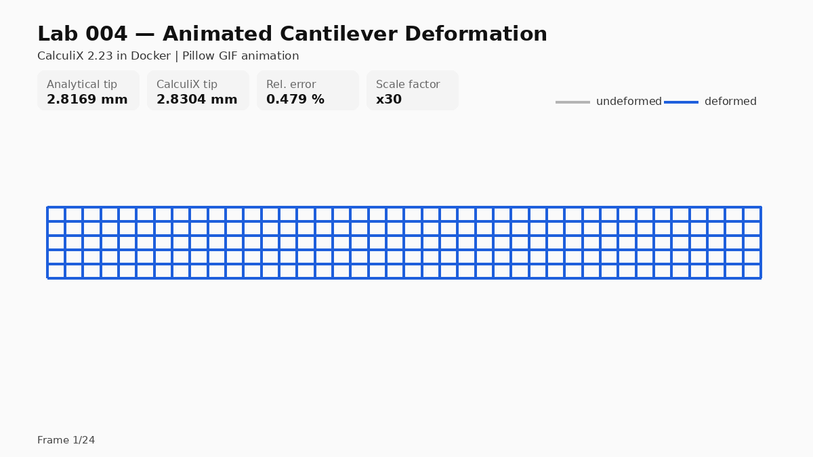

# Lab 004 — Animated Cantilever Deformation

This lab creates an animated deformation GIF for the cantilever shell benchmark.

## Result summary

The animation shows the deformed shape of the cantilever shell benchmark with an amplified deformation scale.

    Analytical tip displacement:       2.8169 mm
    CalculiX mean abs(U3) load nodes:  2.8304 mm
    Relative error based on abs(U3):   0.479 %
    Deformation scale factor:          x30

The physical displacement is small compared with the beam length, so the deformation is intentionally scaled for visualization.

The goal is to turn the previous FEM workflow into a visual result that can be used for technical communication, for example on LinkedIn.

## Workflow

    Python input generation
    CalculiX 2.23 in Docker
    Python .dat postprocessing
    Pillow-based GIF animation

## Relation to previous labs

- Lab 001: baseline CalculiX shell benchmark
- Lab 002: mesh convergence study
- Lab 003: Gmsh-based mesh generation workflow
- Lab 004: animated deformation visualization

## Important note

The animation uses a deformation scale factor. The physical displacement is only about 2.83 mm for a 1000 mm beam, so the plotted deformation is intentionally amplified for visualization.
