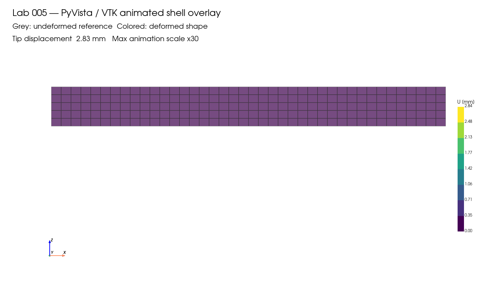

# Lab 005 — PyVista / VTK Postprocessing

This lab demonstrates a small postprocessing workflow for CalculiX results using PyVista and VTK inside Docker.

## Result summary

This lab renders the cantilever shell deformation with PyVista / VTK inside a Docker-based visualization image.

    Nodes: 246
    Shell elements: 200
    Max displacement magnitude: 2.837835 mm
    Deformation scale factor: x30

## Docker image

This lab uses a visualization image based on the CalculiX core image:

    ale10tech/calculix-viz:ccx2.23-ubuntu24.04

The image extends the CalculiX 2.23 Docker setup with the libraries needed for headless PyVista / VTK rendering.

## Run the lab

From the repository root:

    ./labs/005_pyvista_vtk/run_pyvista_vtk.sh

The script creates:

    figures/cantilever_pyvista_deformed_overlay_scale30.png
    figures/cantilever_pyvista_overlay_animation.gif
    results/pyvista_render_summary.txt
    results/pyvista_gif_summary.txt

## Goal

Use a simple cantilever shell benchmark result and create rendered images with PyVista.

## Planned workflow

1. Reuse the cantilever shell benchmark result
2. Read mesh and nodal displacements with Python
3. Build a PyVista mesh
4. Render undeformed and deformed views
5. Export screenshots for GitHub / LinkedIn

## Expected outputs

- figures/cantilever_pyvista_undeformed.png
- figures/cantilever_pyvista_deformed.png
- optional later: comparison image or result card
