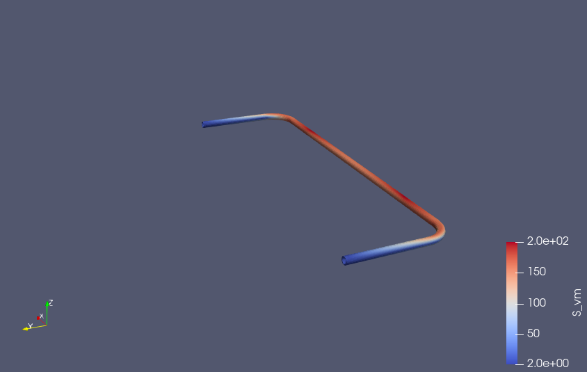

# Lab 008 Results — S4 Shell Tube Stabilizer

## Model summary

This lab demonstrates a simplified tubular anti-roll bar modeled with S4 shell elements in CalculiX.

The model is intentionally simplified and is not intended as a validated OEM stabilizer model. The goal is to demonstrate a reproducible open-source FEM workflow using Docker, CalculiX and ParaView/PyVista-style postprocessing.

## Geometry and mesh

| Quantity | Value |
|---|---:|
| Tube outer diameter | 24.0 mm |
| Wall thickness | 3.0 mm |
| Tube midsurface radius | 10.5 mm |
| Bend radius | 80.0 mm |
| Bushing width | 20.0 mm |
| Element type | S4 |
| Original shell nodes | 4152 |
| Original S4 elements | 4128 |
| FRD result nodes | 8304 |
| FRD result elements | 4128 |

CalculiX expands the shell model internally for FRD output. Therefore, the FRD result mesh contains 8304 nodes, corresponding to two result layers for the 4152 shell midsurface nodes.

## Boundary conditions and load case

| Location | Coupling / constraint |
|---|---|
| Left load end | DCOUP3D / distributing coupling |
| Right load end | DCOUP3D / distributing coupling |
| Left bushing patch | DCOUP3D / distributing coupling |
| Right bushing patch | DCOUP3D / distributing coupling |

The load case is displacement-controlled:

| Reference point | Prescribed displacement |
|---|---:|
| Left load point | Uz = +20 mm |
| Right load point | Uz = -20 mm |

## Reaction forces

From the CalculiX DAT file:

| Reference point | Fz |
|---|---:|
| Left load point | +495.694 N |
| Right load point | -495.694 N |
| Left bushing point | -875.727 N |
| Right bushing point | +875.727 N |

Approximate one-side vertical rate:

k_side = 495.694 N / 20 mm = 24.78 N/mm

## Stress result

From the FRD-to-VTU postprocessing:

| Quantity | Value |
|---|---:|
| max displacement magnitude | 20.126 mm |
| p99 displacement magnitude | 19.909 mm |
| max von Mises stress | 198.15 MPa |
| p99 von Mises stress | 189.57 MPa |

## Visualization

## Notes

The attempted RBE2-like coupling using *RIGID BODY and *COUPLING / *KINEMATIC was not compatible with CalculiX shell nodes. CalculiX reported that shell element nodes must not be subject to a RIGID MPC.

The working CalculiX-compatible approach uses DCOUP3D / distributing coupling for both the load introduction rings and the bushing patches.
